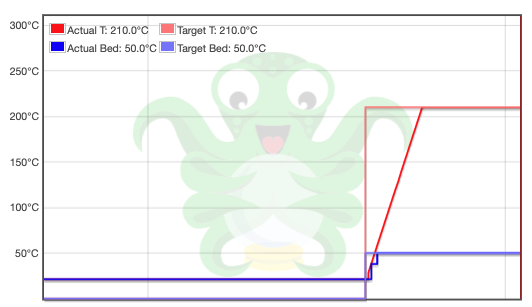
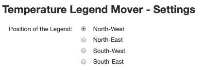

# Temperature Legend Mover

A OctoPrint-Plugin that moves the Temperature-Legend into a specific corner

#### Support my Efforts

This plugin, as well as my [other plugins](https://github.com/OllisGit/) were developed in my spare time.
If you like it, I would be thankful about a cup of coffee :)

## Setup

Install via the bundled [Plugin Manager](https://docs.octoprint.org/en/master/bundledplugins/pluginmanager.html)
or manually using this URL:

    https://github.com/OllisGit/OctoPrint-TemperatureLegendMover/releases/latest/download/master.zip

## Configuration

It is possible to change the position of the legend. See Plugin-Settings.

## Versions
see [Release-Overview](https://github.com/OllisGit/OctoPrint-TemperatureLegendMover/releases/)
